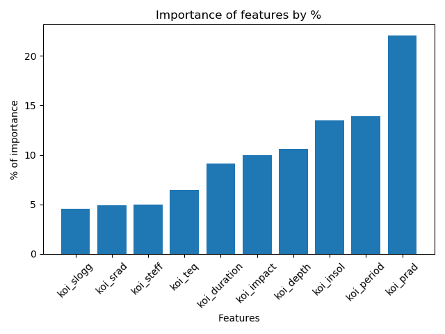

# Findings from ML models of exoplanet classification

## Model 1: Using K-means clustering

This model was somewhat accurate, with a higher accuracy of test data than training data. At **79.72%** and **79.41%**, respectively.

## Model 2: Using a random trees classifier

This model was much more accurate and I was able to get an insight into the most important features. The training data was **99.27%** accurate whereas the test data was **87.93%** accurate, which still isn't bad.

The most important features are koi_prad, koi_period, and koi_insol as outlined in this graph:

